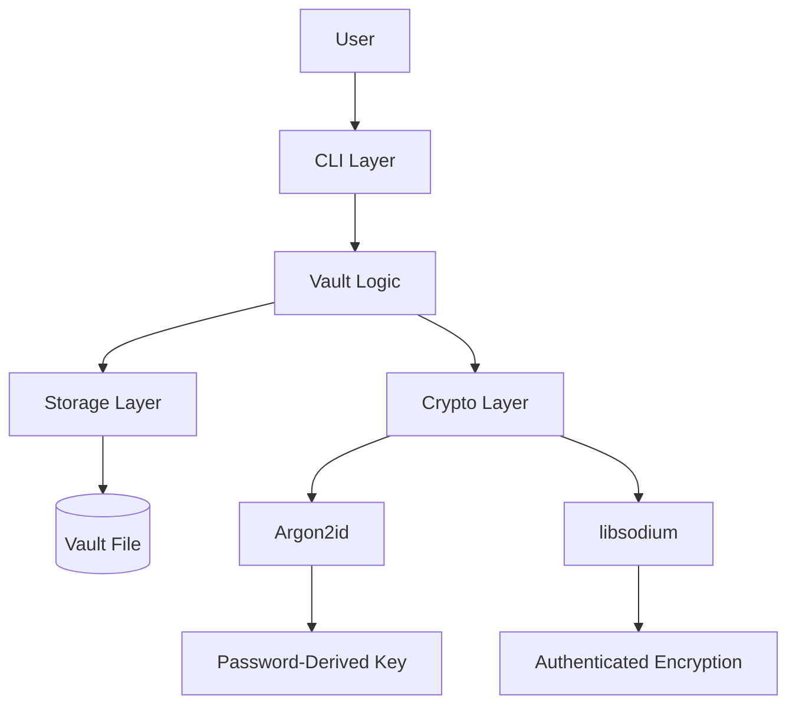
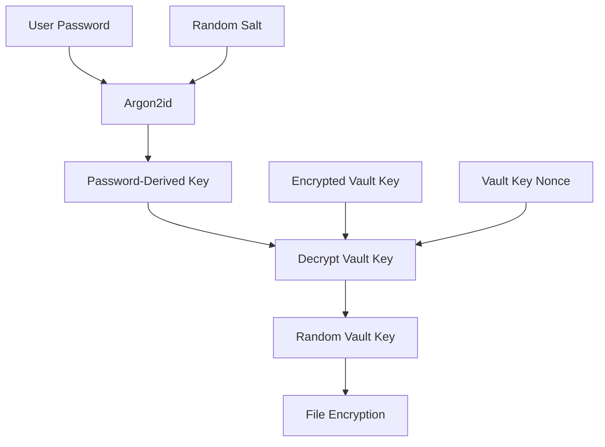
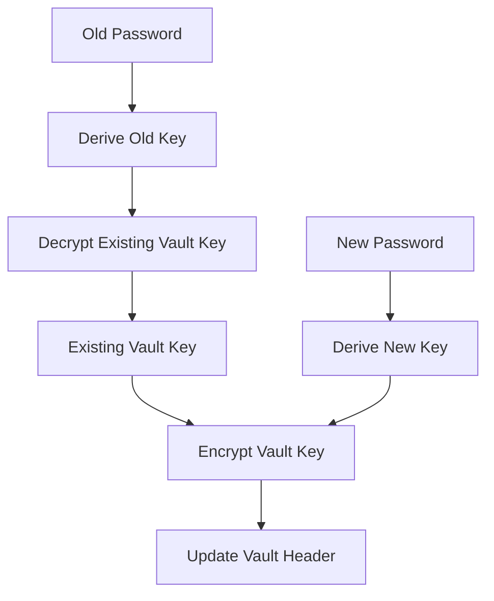
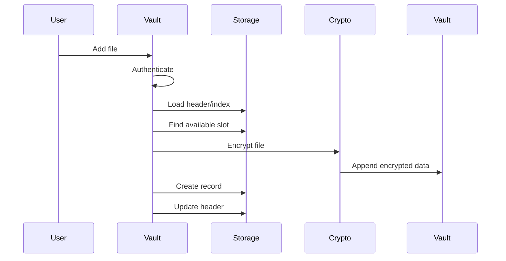
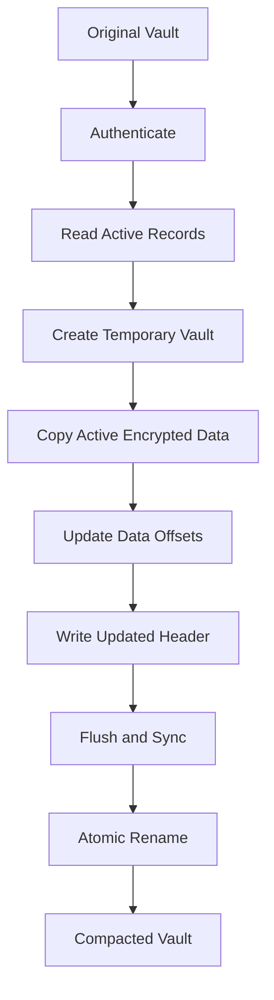

# VaultC — System Design

## 1. Introduction

VaultC is a command-line encrypted file vault implemented in C.

The system provides a single binary container in which users can securely store multiple files and directory trees. The vault supports authentication, authenticated encryption, file management, integrity verification, password changes, and storage compaction.

The design prioritizes:

- Security
- Data integrity
- Explicit binary storage
- Streaming file processing
- Predictable resource usage
- Modular C implementation
- Testability

VaultC is designed as an educational systems project rather than a replacement for professionally audited encryption software.

---

# 2. Requirements

## 2.1 Functional Requirements

The system must allow users to:

1. Create a new vault.
2. Authenticate to an existing vault.
3. Add files to a vault.
4. Add directories recursively.
5. List stored files.
6. Search stored files.
7. Extract files.
8. Remove files.
9. Rename files.
10. Change the vault password.
11. Verify vault integrity.
12. Compact the vault.

## 2.2 Security Requirements

The system should:

- Never store the plaintext password.
- Derive cryptographic key material using a password-based KDF.
- Use randomly generated cryptographic values.
- Encrypt file contents using authenticated encryption.
- Detect tampering with encrypted file data.
- Reject incorrect passwords.
- Avoid inventing custom cryptographic algorithms.
- Minimize unnecessary exposure of sensitive key material in memory.

## 2.3 Storage Requirements

The vault format should:

- Support multiple files.
- Support nested directory paths.
- Store arbitrary binary data.
- Support files larger than typical memory sizes.
- Use 64-bit file offsets.
- Avoid compiler-dependent struct serialization.
- Detect malformed vault metadata.
- Allow deleted record slots to be reused.
- Allow unused encrypted data to be reclaimed through compaction.

---

# 3. High-Level Architecture

VaultC is divided into four primary layers.



The layers have intentionally different responsibilities.

### CLI Layer

Responsible for:

- Reading command-line arguments
- Validating command syntax
- Displaying usage information
- Dispatching commands

### Vault Layer

Responsible for:

- Authentication
- File management
- Directory traversal
- Vault lifecycle operations
- Coordinating storage and cryptography

### Storage Layer

Responsible for:

- Binary serialization
- Binary deserialization
- Vault headers
- File records
- Index management
- Structural validation

### Crypto Layer

Responsible for:

- Random generation
- Password-based key derivation
- Vault-key protection
- File encryption
- File decryption

---

# 4. Module Design

## 4.1 `main.c`

The program entry point is intentionally small.

```text
main()
  |
  v
handle_command()
```

This keeps command processing outside the program entry point.

---

## 4.2 `cli.c`

The CLI module translates user commands into application operations.

Examples:

```text
vault create <vault>
vault add <vault> <file>
vault list <vault>
vault extract <vault> <file>
vault remove <vault> <file>
vault rename <vault> <old> <new>
vault search <vault> <query>
vault verify <vault>
vault passwd <vault>
vault compact <vault>
```

The CLI does not implement encryption or binary storage.

---

## 4.3 `vault.c`

`vault.c` is the main orchestration layer.

It coordinates:

```text
User Request
     |
     v
Authentication
     |
     +--------> Storage
     |
     +--------> Crypto
     |
     v
Vault Operation
```

Operations include:

- Creating vaults
- Opening vaults
- Loading the vault key
- Adding files
- Adding directories
- Extracting files
- Removing files
- Renaming files
- Searching
- Verifying
- Changing passwords
- Compacting

---

## 4.4 `storage.c`

The storage module defines how C data structures become bytes on disk.

It provides operations for:

- Writing vault headers
- Reading vault headers
- Validating headers
- Writing file records
- Reading file records
- Validating records
- Loading the file index

Storage does not perform encryption.

---

## 4.5 `crypto.c`

The crypto module isolates cryptographic operations from the rest of the application.

It provides:

```text
Random generation
       |
       v
Argon2id
       |
       v
Key derivation
       |
       +---- Vault key protection
       |
       +---- File encryption/decryption
```

The implementation uses established cryptographic primitives from libsodium rather than implementing cryptography manually.

---

# 5. Cryptographic Design

## 5.1 Key Hierarchy

VaultC uses two important keys.



The terminology is:

- **Password** — secret supplied by the user.
- **KEK** — password-derived key used to protect the vault key.
- **DEK / Vault Key** — random key used to encrypt file data.

The important design decision is that the password-derived key is **not directly used as the long-term file encryption key**.

---

# 6. Password Authentication

When a vault is created:

```text
Password
   |
   v
Generate Random Salt
   |
   v
Argon2id
   |
   v
Password-Derived Key
```

A random vault key is also generated.

The vault key is encrypted using the password-derived key.

The resulting authentication material and encrypted vault key are stored in the vault header.

When opening a vault:

```text
User Password
      |
      v
Argon2id + Stored Salt
      |
      v
Derived Key
      |
      v
Authenticate / Decrypt Vault Key
      |
      +---- Failure ---> Reject Access
      |
      v
Random Vault Key
```

This means an incorrect password cannot successfully recover the vault key.

---

# 7. Password Change Design

Changing the password does not require re-encrypting every file.

The process is:



Only the protected vault-key material changes.

The encrypted file data remains untouched.

This makes password changes efficient even when the vault contains large files.

---

# 8. File Encryption Design

VaultC uses libsodium's XChaCha20-Poly1305-based SecretStream construction for file encryption.

Files are processed in chunks.

```text
Input File
    |
    v
Read Chunk
    |
    v
SecretStream Encryption
    |
    v
Encrypted Chunk
    |
    v
Write to Vault
    |
    v
Read Next Chunk
```

The chunk size used by the implementation is:

```text
8192 bytes
```

The encrypted output includes SecretStream authentication overhead.

A dedicated stream header is stored in the corresponding file record.

---

# 9. Why Streaming Encryption?

A simpler implementation could read an entire file into memory:

```text
File
 |
 v
malloc(file_size)
 |
 v
Encrypt
```

This does not scale well for large files.

VaultC instead uses:

```text
File
 |
 +--> Chunk 1 --> Encrypt --> Write
 |
 +--> Chunk 2 --> Encrypt --> Write
 |
 +--> Chunk 3 --> Encrypt --> Write
 |
 +--> ...
```

Benefits:

- Lower memory usage
- Large files can be processed
- Predictable memory requirements
- Better suited to a file-storage application

---

# 10. Vault Container Format

A vault consists of three primary regions.

```text
+--------------------------------+
|         Vault Header           |
+--------------------------------+
|          File Index            |
+--------------------------------+
|        Encrypted Data          |
+--------------------------------+
```

## 10.1 Header

The header contains:

```text
Magic
Version
Header Size
Index Offset
Index Size
Data Offset
Active File Count
Password Salt
Password Authentication Material
Vault-Key Nonce
Encrypted Vault Key
```

The serialized header occupies:

```text
158 bytes
```

---

# 11. File Index

VaultC reserves space for a fixed number of records.

Current maximum:

```text
128 records
```

Each record contains:

```text
File ID
File Name / Relative Path
Original Size
Encrypted Size
Data Offset
SecretStream Header
Active State
```

The serialized record size is:

```text
309 bytes
```

The index therefore occupies:

```text
309 × 128 = 39552 bytes
```

The index is fixed-size to keep lookup and slot management simple.

---

# 12. Binary Serialization

C structs are not written directly to disk.

For example, instead of:

```c
fwrite(&value, sizeof(value), 1, file);
```

fixed-width integers are explicitly encoded.

For a 32-bit integer:

```text
Byte 0 = least significant 8 bits
Byte 1 = next 8 bits
Byte 2 = next 8 bits
Byte 3 = most significant 8 bits
```

The same approach is used for 64-bit integers.

This provides a defined binary representation independent of compiler-specific struct padding.

---

# 13. File Offsets

File positions are represented using 64-bit values.

Each file record stores:

```text
data_offset
encrypted_size
```

The encrypted data occupies:

```text
[data_offset, data_offset + encrypted_size)
```

Before performing calculations, the implementation checks for integer overflow.

This prevents malformed metadata from causing wrapped offsets.

---

# 14. Adding a File

The file-addition flow is:



The original file is never modified.

Its bytes are read and transformed into encrypted data in the vault.

---

# 15. Recursive Directory Support

When a directory is supplied, VaultC recursively traverses it.

Example:

```text
project/
├── src/
│   ├── main.c
│   └── vault.c
└── docs/
    └── notes.txt
```

The stored paths become:

```text
project/src/main.c
project/src/vault.c
project/docs/notes.txt
```

The relative path is stored in the file record.

During extraction, missing parent directories are created automatically.

---

# 16. File Removal

VaultC uses logical deletion.

When a file is removed:

```text
active = 0
```

The encrypted data is not immediately rewritten or erased.

This avoids rewriting potentially large portions of the vault.

Example:

```text
Before:

[A][B][C][D]

Remove B:

[A][inactive][C][D]
```

The inactive record slot can later be reused.

---

# 17. Compaction

Logical deletion creates unused encrypted regions.

Compaction removes those unused regions.



Only active encrypted data is copied.

The encrypted bytes themselves are not decrypted and re-encrypted.

This is both faster and cryptographically cleaner because compaction does not need to alter the encryption state of the files.

---

# 18. Atomic Vault Replacement

Compaction creates a temporary file in the same directory as the original vault.

The general process is:

```text
Original Vault
      |
      v
Temporary Vault
      |
      v
Write + Flush + Sync
      |
      v
Rename Temporary File
      |
      v
Original Vault Path
```

Using a temporary file avoids modifying the original vault incrementally.

The final rename provides an atomic replacement operation on the same filesystem.

---

# 19. Vault Verification

Verification checks both structural and cryptographic correctness.

The process includes:

```text
Read Header
    |
    v
Validate Header
    |
    v
Read File Index
    |
    v
Validate Records
    |
    v
Authenticate Vault
    |
    v
Process Active Encrypted Files
    |
    v
Verify Authentication
```

A corrupted or tampered encrypted stream should fail authenticated decryption.

---

# 20. Error Handling

VaultC follows a fail-closed approach for security-sensitive operations.

Examples:

```text
Invalid Password
      |
      v
Reject Operation
```

```text
Invalid Vault Header
      |
      v
Reject Vault
```

```text
Authentication Failure
      |
      v
Reject Data
```

```text
File Read Failure
      |
      v
Abort Operation
```

Operations check:

- File opening
- Memory allocation
- File seeking
- File reading
- File writing
- Cryptographic initialization
- Cryptographic authentication
- Integer overflow conditions
- Vault metadata validity

---

# 21. Security Considerations

## Password Security

Passwords are processed using Argon2id rather than a simple hash.

A random salt prevents identical passwords from producing identical derived values across vaults.

## Authenticated Encryption

Encryption alone is insufficient because modified ciphertext could otherwise go undetected.

Authenticated encryption provides confidentiality and integrity for encrypted file data.

## Random Keys

The vault encryption key is randomly generated instead of being directly derived from the password.

## Key Separation

The password-derived key protects the vault key, while the vault key protects file contents.

This makes password changes efficient.

## Sensitive Memory

Cryptographic key buffers are cleared after use where appropriate.

## No Custom Cryptography

VaultC relies on established cryptographic implementations from libsodium rather than implementing primitives manually.

---

# 22. Threat Model

VaultC primarily protects against an attacker who obtains a copy of the vault file but does not know the password.

The intended protection includes:

```text
Attacker obtains vault
        |
        v
Reads encrypted data
        |
        v
Cannot recover file contents
without successful key recovery
```

The authenticated encryption layer also detects unauthorized modification of encrypted file data.

VaultC does not attempt to protect against:

- A compromised operating system
- Malware already running under the user's account
- A compromised machine
- Passwords that are already known to an attacker
- Memory extraction from a compromised running process
- Professional forensic attacks beyond the project's scope

---

# 23. Design Trade-offs

## Fixed Index vs Dynamic Index

### Chosen

Fixed index with 128 records.

### Advantages

- Simple implementation
- Predictable layout
- Easy record lookup
- Easy slot reuse

### Disadvantages

- Fixed maximum number of records
- Unused index space consumes storage

---

## Logical Delete vs Immediate Rewriting

### Chosen

Logical deletion followed by optional compaction.

### Advantages

- Fast removal
- Less rewriting
- Simpler implementation
- Better performance for frequent deletes

### Disadvantages

- Deleted data remains physically present until compaction
- Vault size does not immediately decrease

---

## Streaming vs Whole-File Encryption

### Chosen

Streaming encryption.

### Advantages

- Low memory usage
- Supports large files
- Predictable memory requirements

### Disadvantages

- More complicated implementation
- Requires careful stream boundary handling

---

## Random Vault Key vs Password-Derived File Key

### Chosen

Random vault key protected by a password-derived key.

### Advantages

- Efficient password changes
- Separation of password and file encryption
- Strong key generation independent of password quality

### Disadvantages

- More metadata and key-management logic
- Additional cryptographic operation during authentication

---

# 24. Testing Strategy

Testing was divided into layers.

## Cryptographic Tests

Tested:

- Random generation
- Key derivation
- Password verification
- Vault-key encryption/decryption
- Tampering detection

## File Crypto Tests

Boundary cases were deliberately tested:

```text
0 bytes
1 byte
8191 bytes
8192 bytes
8193 bytes
100 KB
```

The 8192-byte boundary was particularly important because the encryption system processes data in 8192-byte chunks.

## Integration Tests

The complete workflow was tested:

```text
Create
  ↓
Add
  ↓
List
  ↓
Extract
  ↓
Compare
  ↓
Verify
  ↓
Remove
  ↓
Verify
```

## Sanitizer Testing

AddressSanitizer and UndefinedBehaviorSanitizer were used to identify memory and undefined-behavior problems.

---

# 25. Known Limitations

Current limitations include:

- Maximum of 128 file records
- Fixed cryptographic parameters
- Metadata is not independently encrypted
- File names remain visible inside the vault structure
- No crash-recovery journal
- No concurrent access handling
- No filesystem-level locking
- No secure deletion guarantee for removed data
- No fuzzing framework currently integrated

These limitations are documented as deliberate scope boundaries for the current project.

---

# 26. Future Improvements

Possible future versions could include:

1. Dynamic index allocation
2. Authenticated metadata
3. Metadata encryption
4. Crash-recovery journaling
5. Filesystem locking
6. Fuzz testing
7. Configurable cryptographic parameters
8. Cross-platform compatibility
9. More advanced recovery mechanisms
10. Stronger secure-memory handling

These improvements are outside the current implementation scope.

---

# 27. Design Summary

VaultC combines four major concerns:

```text
             +----------------+
             |   CLI Layer    |
             +-------+--------+
                     |
                     v
             +----------------+
             |  Vault Logic   |
             +---+--------+---+
                 |        |
          +------+        +------+
          v                      v
   +-------------+        +-------------+
   |   Storage   |        |    Crypto   |
   +------+------+        +------+------+
          |                      |
          v                      v
   Binary Vault             libsodium /
   Container                Argon2id
```

The central design principle is separation of concerns.

The CLI understands commands.

The vault layer understands operations.

The storage layer understands bytes and metadata.

The cryptographic layer understands keys and authenticated encryption.

This separation keeps the system understandable while allowing each major area to be tested independently.