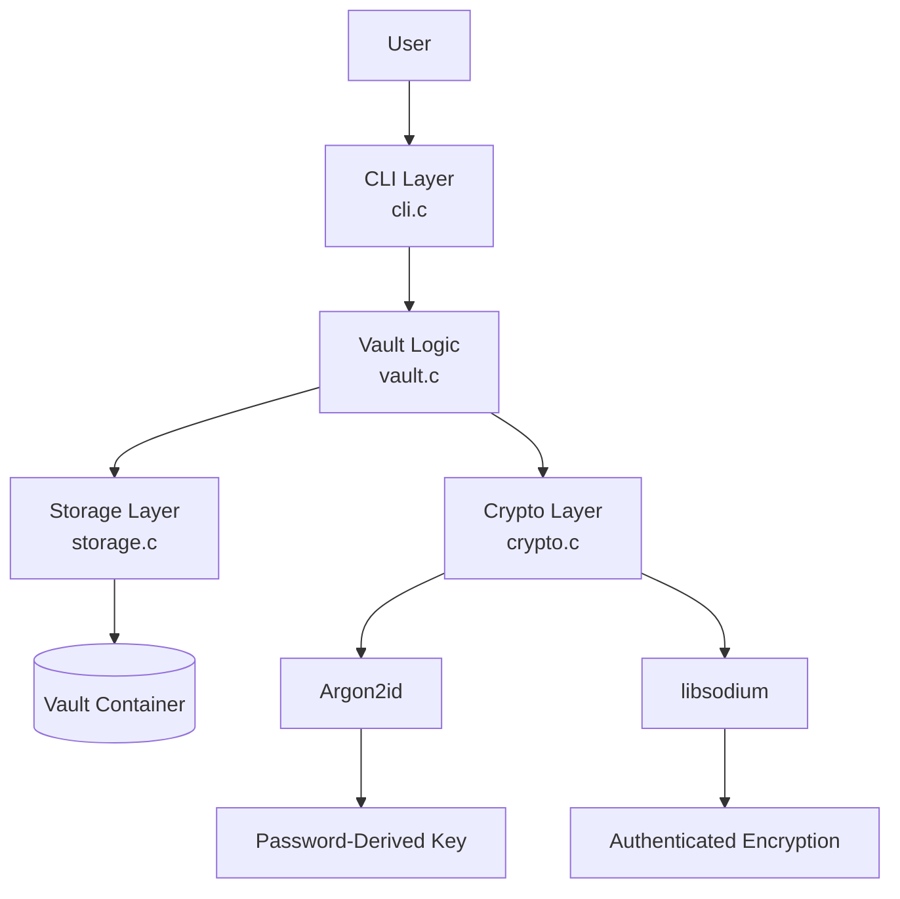
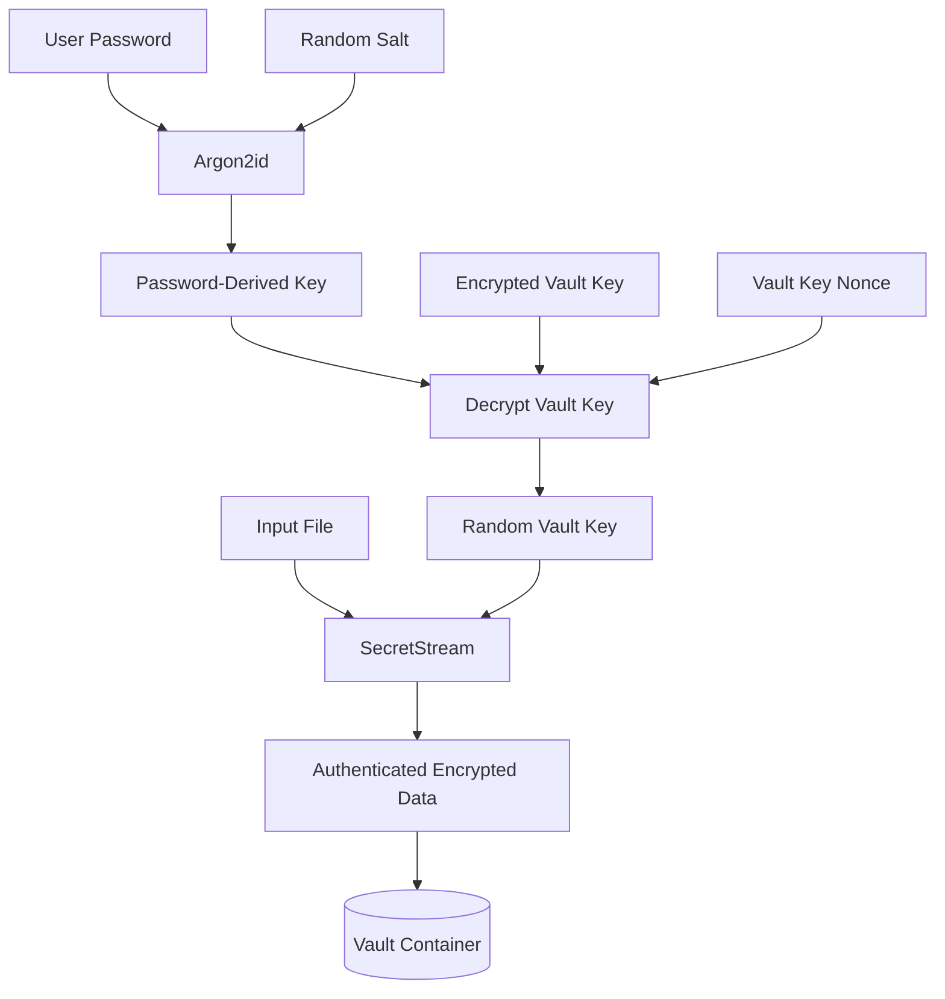
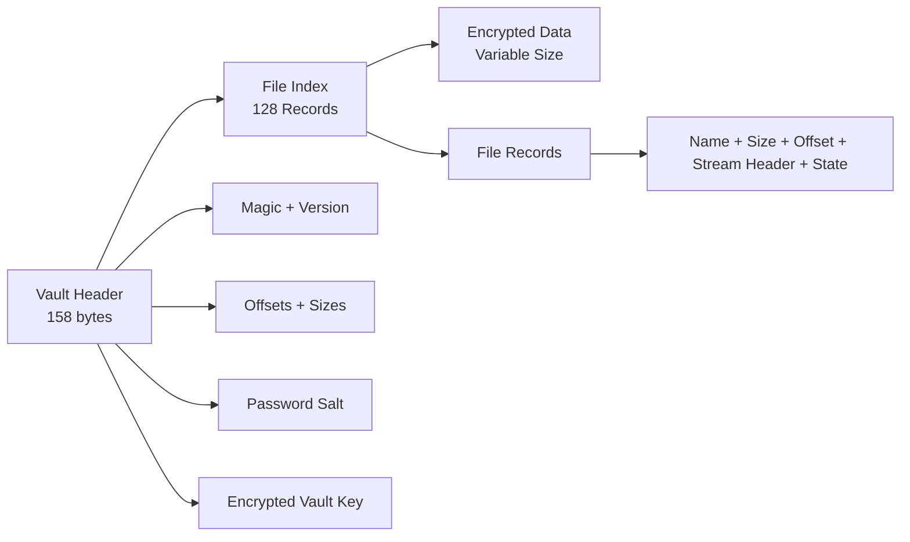
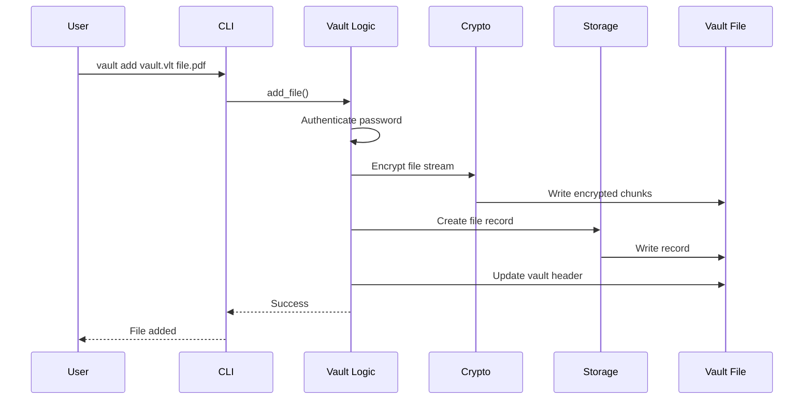

# VaultC

**VaultC** is a secure command-line file vault written entirely in C.

It allows users to create independent encrypted vaults, securely store files and directories, authenticate using a password, list and search stored files, extract them, remove files, change vault passwords, and compact vaults to reclaim unused storage.

The project was built as a systems-oriented learning journey to understand how file storage, binary serialization, memory management, cryptography, authentication, streaming I/O, error handling, testing, and security engineering work together in a real C application.


---
## Project Highlights

- 🔐 Password-protected encrypted vaults
- 🔑 Argon2id key derivation with random salts
- 🛡️ Authenticated encryption using libsodium
- 📦 Streaming encryption for large files
- 📁 Recursive directory support
- 🔄 Password changes without re-encrypting stored files
- 🗜️ Vault compaction for reclaiming deleted-file storage
- 🔎 File listing and search
- 🧪 25 automated tests
- 🧰 AddressSanitizer and UndefinedBehaviorSanitizer testing
- 💻 Built entirely in C

---

## Example Workflow

```bash
# Create a vault
./vault create personal.vlt

# Add files
./vault add personal.vlt document.pdf
./vault add personal.vlt photos/

# View stored files
./vault list personal.vlt

# Search the vault
./vault search personal.vlt photos

# Extract a file
./vault extract personal.vlt document.pdf

# Remove a file
./vault remove personal.vlt document.pdf

# Change the vault password
./vault passwd personal.vlt

# Verify the vault
./vault verify personal.vlt

# Reclaim unused storage
./vault compact personal.vlt
```

A typical vault can therefore be used as a self-contained encrypted storage container:

```text
personal.vlt
├── document.pdf
├── photos/
│   ├── beach.jpg
│   └── mountain.jpg
└── projects/
    └── report.docx
```
## Problem Statement

Managing sensitive files through ordinary directories provides little protection beyond the operating system's file permissions.

VaultC addresses this problem by providing a portable encrypted container that can hold multiple files inside a single vault.

Instead of protecting individual files separately, VaultC provides a single encrypted storage boundary:

```text
User
  |
  v
Password
  |
  v
Vault Authentication
  |
  v
Encrypted Vault
  |
  +---- File 1
  +---- File 2
  +---- Directory/File 3
  +---- Directory/File 4
```

The goal was not to build another filesystem, but to understand the engineering challenges involved in designing a secure binary file container.

---

## Motivation

VaultC was developed to explore several low-level concepts that are difficult to understand through isolated examples:

- Binary file handling in C
- Manual memory management
- Binary serialization
- File offsets and random access
- Password-based key derivation
- Authenticated encryption
- Streaming large files
- Recursive directory traversal
- Data integrity verification
- Error handling
- Automated testing
- Sanitizer-based debugging
- Secure file replacement
- Designing a custom binary container format

The project therefore focuses as much on the **learning process and engineering decisions** as on the final application.

---

## Features

### Vault Management

- Create independent vault files
- Authenticate vaults using a password
- Verify vault integrity
- Change vault passwords
- Compact vault storage

### File Management

- Add individual files
- Add complete directory trees recursively
- List stored files
- Search files by name/path
- Extract files
- Remove files
- Rename files
- Reuse inactive vault slots

### Security

- Argon2id password-based key derivation
- Random vault encryption key
- Password-derived key used to protect the vault key
- XChaCha20-Poly1305 authenticated encryption
- Streaming encryption for files
- Authentication failure on tampered encrypted data
- Secure temporary-file replacement during compaction

### Engineering

- Explicit binary serialization
- Fixed-width integer encoding
- 64-bit file offsets
- Structured vault validation
- Automated tests
- AddressSanitizer / UndefinedBehaviorSanitizer testing
- Makefile-based build system

---

## Why C?

VaultC was deliberately implemented in C to work close to the underlying storage and memory model.

Using C required explicit handling of:

- `FILE *` streams
- Binary reads and writes
- Memory allocation and deallocation
- File offsets
- Buffers
- Struct representation
- Serialization
- Error conditions
- Operating-system file operations

This made problems such as integer overflow, incorrect buffer sizes, serialization portability, and file-position handling visible instead of being hidden by higher-level abstractions.

---

## Technology Stack

| Component | Technology |
|---|---|
| Language | C |
| Compiler | GCC |
| Build System | Make |
| Password KDF | Argon2id |
| Cryptography | libsodium |
| Authenticated Encryption | XChaCha20-Poly1305 |
| File Encryption | libsodium SecretStream |
| Testing | Custom C test programs |
| Memory Safety Testing | AddressSanitizer / UndefinedBehaviorSanitizer |
| Development Environment | Linux / WSL2 |

---

## Architecture

VaultC follows a layered architecture where command-line input is separated from vault operations, storage management, and cryptographic operations.



### Module Responsibilities

| Module | Responsibility |
|---|---|
| `main.c` | Program entry point |
| `cli.c` | Command parsing and dispatch |
| `vault.c` | Vault operations and application logic |
| `storage.c` | Binary serialization and vault records |
| `crypto.c` | Key derivation and encryption |
| `tests/` | Automated functional and cryptographic tests |

The layers intentionally have separate responsibilities. For example, `storage.c` does not perform encryption, while `crypto.c` does not manage vault records.

This separation makes the implementation easier to test, reason about, and modify.

---

## Authentication and Encryption Flow

VaultC uses a randomly generated vault key rather than encrypting every file directly with the user's password-derived key.



The separation provides an important property: changing the password does not require re-encrypting all stored files.

During a password change:

```text
Old Password
     |
     v
Old Password-Derived Key
     |
     v
Decrypt Vault Key
     |
     v
Same Random Vault Key
     |
     v
New Password-Derived Key
     |
     v
Re-encrypt Vault Key
```

The encrypted file data remains unchanged.

---

## Vault Binary Layout

Each `.vlt` file contains a fixed-size header, a fixed-size file index, and encrypted file data.



Conceptually:

```text
+------------------------------------------------+
|                  Vault Header                  |
|-----------------------------------------------|
| Magic                                         |
| Version                                       |
| Header Size                                   |
| Index Offset / Size                           |
| Data Offset                                   |
| Active File Count                             |
| Password Salt                                 |
| Password Authentication Material              |
| Vault-Key Nonce                               |
| Encrypted Vault Key                            |
+------------------------------------------------+
|                  File Index                   |
|-----------------------------------------------|
| Record 1                                      |
| Record 2                                      |
| ...                                            |
| Record 128                                    |
+------------------------------------------------+
|                Encrypted Data                 |
|-----------------------------------------------|
| SecretStream Header + Encrypted File Data     |
| SecretStream Header + Encrypted File Data     |
| ...                                            |
+------------------------------------------------+
```

The binary format uses explicit integer serialization rather than writing C structs directly to disk.

This avoids problems caused by compiler-dependent struct padding and representation.

Each active file record points to its encrypted data using a 64-bit offset and stores the original and encrypted sizes.

---

## Data Flow

A typical file addition follows this path:



Extraction follows the reverse direction:

```text
Vault
  |
  v
Read File Record
  |
  v
Locate Encrypted Data
  |
  v
Authenticate + Decrypt Stream
  |
  v
Write Original Bytes
  |
  v
Output File
```

### Modules

#### `main.c`

Program entry point.

It passes command-line arguments to the CLI handler.

#### `cli.c`

Responsible for:

- Command parsing
- Usage information
- Dispatching commands to the vault layer

#### `vault.c`

Contains the main application logic:

- Vault creation
- Authentication
- File addition
- Directory traversal
- Extraction
- Removal
- Renaming
- Searching
- Password changes
- Compaction
- Verification

#### `storage.c`

Responsible for the vault's binary representation:

- Header serialization
- Header deserialization
- File-record serialization
- File-record deserialization
- Header validation
- Record validation
- File-index loading

#### `crypto.c`

Responsible for cryptographic operations:

- Random byte generation
- Salt generation
- Argon2id key derivation
- Vault-key encryption/decryption
- Streaming file encryption
- Streaming file decryption

---

## Vault Structure

A VaultC file is a binary container.

```text
+------------------------------+
|        Vault Header          |
+------------------------------+
|        File Index            |
|                              |
|  Record 1                    |
|  Record 2                    |
|  ...                         |
|  Record 128                  |
+------------------------------+
|        Encrypted Data        |
|                              |
|  Encrypted File 1            |
|  Encrypted File 2            |
|  ...                         |
+------------------------------+
```

The vault header contains information such as:

- Vault format version
- Header size
- Index location
- Index size
- Data location
- Active file count
- Password salt
- Password-derived authentication material
- Vault-key encryption nonce
- Encrypted vault key

Each file record contains:

- File ID
- File name/path
- Original file size
- Encrypted size
- Data offset
- SecretStream header
- Active/inactive state

The format uses explicit serialization rather than writing C structs directly to disk.

This avoids depending on compiler-specific struct padding and makes the binary layout predictable.

---

## Encryption Model

VaultC uses two levels of keys.

```text
                    Password
                       |
                       v
                   Argon2id
                       |
                       v
               Password-Derived Key
                       |
                       v
             Encrypt / Decrypt
                 Vault Key
                       |
                       v
              Random Vault Key
                       |
                       v
              Encrypt File Data
```

### Password

The user provides a password when accessing the vault.

### Argon2id

The password is processed using Argon2id with a random salt to derive cryptographic key material.

### Vault Key

Each vault has a randomly generated 256-bit encryption key.

The vault key is encrypted using the password-derived key.

This separates password authentication from file encryption.

### File Encryption

Files are encrypted using libsodium's XChaCha20-Poly1305-based SecretStream construction.

Files are processed in chunks rather than loading the complete file into memory.

This allows VaultC to work with files larger than the available RAM.

---

## File Encryption Flow

```text
Original File
     |
     v
Read Chunk
     |
     v
Authenticated Encryption
     |
     v
Encrypted Chunk
     |
     v
Vault Container
```

Extraction performs the reverse operation:

```text
Vault Container
     |
     v
Encrypted Chunk
     |
     v
Authenticated Decryption
     |
     v
Original Chunk
     |
     v
Output File
```

If authentication fails, extraction is rejected.

---

## Directory Support

VaultC can recursively add directories.

For example:

```text
College/
├── DBMS/
│   ├── notes.pdf
│   └── queries.sql
├── DSA/
│   ├── trees.cpp
│   └── graphs.cpp
└── Networks/
    └── notes.pdf
```

can be stored using relative paths:

```text
College/DBMS/notes.pdf
College/DBMS/queries.sql
College/DSA/trees.cpp
College/DSA/graphs.cpp
College/Networks/notes.pdf
```

During extraction, the required parent directories are automatically recreated.

---

## Removing and Compacting Files

Removing a file does not immediately rewrite the entire vault.

Instead, VaultC marks its record as inactive.

```text
Before:

[File A][File B][File C][File D]

Remove B:

[File A][Unused][File C][File D]
```

This avoids expensive rewriting during every deletion.

However, the unused encrypted data remains in the vault.

The `compact` command solves this:

```text
Before compaction:

[File A][Unused][File C][Unused][File D]

After compaction:

[File A][File C][File D]
```

Compaction creates a temporary vault, copies active encrypted data into packed positions, updates the index, and atomically replaces the original vault.

---

## Command Reference

### Create a vault

```bash
./vault create personal.vlt
```

### Add a file

```bash
./vault add personal.vlt document.pdf
```

### Add a directory

```bash
./vault add personal.vlt College/
```

### List files

```bash
./vault list personal.vlt
```

### Search

```bash
./vault search personal.vlt notes
```

### Extract a file

```bash
./vault extract personal.vlt document.pdf
```

### Remove a file

```bash
./vault remove personal.vlt document.pdf
```

### Rename a file

```bash
./vault rename personal.vlt old.pdf new.pdf
```

### Change password

```bash
./vault passwd personal.vlt
```

### Verify vault

```bash
./vault verify personal.vlt
```

### Compact vault

```bash
./vault compact personal.vlt
```

---

## Building

### Requirements

Ubuntu/Linux environment with:

- GCC
- Make
- Argon2 development library
- libsodium development library

On Ubuntu:

```bash
sudo apt update
sudo apt install gcc make libargon2-dev libsodium-dev
```

### Build

```bash
make
```

The executable will be created as:

```text
./vault
```

### Clean build artifacts

```bash
make clean
```

---

## Testing

VaultC includes automated tests covering the cryptographic layer, file encryption layer, and complete vault workflow.

Current baseline test coverage:

```text
Crypto tests:          10/10
File crypto tests:      6/6
Vault integration:      9/9
--------------------------------
Total:                 25/25
```

Tests include:

- Random byte generation
- Randomness checks
- Password key derivation
- Correct password verification
- Wrong password rejection
- Vault-key encryption/decryption
- Tampered vault-key rejection
- Empty file encryption
- 1-byte files
- 8191-byte files
- 8192-byte files
- 8193-byte files
- 100 KB files
- Vault creation
- File addition
- File extraction
- File comparison
- Vault verification
- File removal

Run the complete test suite:

```bash
make test
```

---

## Security Testing

VaultC was also tested using compiler sanitizers.

Example:

```bash
gcc -Wall -Wextra -fsanitize=address,undefined ...
```

The project was checked for:

- Memory errors
- Undefined behavior
- Buffer-related problems
- Invalid memory access
- Integer-related issues discovered during testing

The vault was also tested against corrupted and tampered encrypted data to ensure authentication failures are detected.

---

## Important Engineering Problems Solved

Several bugs and design problems were discovered during development.

### 1. SecretStream Boundary Bug

Testing an exactly 8192-byte file exposed an incorrect assumption about the authentication overhead produced by SecretStream.

The encrypted chunk overhead was initially treated as 16 bytes when the actual SecretStream output required 17 bytes.

This resulted in an incorrect buffer calculation.

The boundary test was changed to explicitly test:

```text
8191 bytes
8192 bytes
8193 bytes
```

This led to the correct stream tag size being represented in the code.

### 2. Removed File Overwrite Bug

Initially, new encrypted data could potentially overlap data belonging to removed files.

The storage strategy was changed so that new data is appended after existing encrypted data, while removed records are reused separately.

Compaction can later reclaim the unused encrypted space.

### 3. Slot Management

Vault records use a fixed-size index.

Inactive slots can be reused instead of continuously increasing the number of records.

The active file count is maintained separately from the physical number of index slots.

### 4. Raw Struct Serialization

Writing C structs directly to disk was avoided because struct padding and platform representation can vary.

Instead, integer values are explicitly serialized in a defined byte order.

This makes the vault format more predictable.

### 5. Large File Offsets

File offsets were changed to 64-bit values.

This prevents the storage model from being unnecessarily limited to smaller files.

### 6. Record Validation

Vault records are validated before being trusted.

Checks include:

- Valid file IDs
- Valid file names
- Valid offsets
- Integer overflow protection
- Valid encrypted sizes
- Valid active records

### 7. Password Changes

Changing a password does not require re-encrypting every stored file.

The password-derived key is changed and the existing random vault key is encrypted again using the new password-derived key.

This avoids unnecessary processing of potentially large files.

### 8. Compaction

Deletion intentionally leaves encrypted data untouched to avoid rewriting the entire vault.

Compaction provides a separate operation for reclaiming that storage.

---

## Learning Journey

VaultC was developed incrementally rather than being designed completely in advance.

The learning progression was:

```text
C Fundamentals
      ↓
Binary Files
      ↓
Serialization
      ↓
Memory Management
      ↓
File Offsets
      ↓
Cryptography
      ↓
Password-Based Key Derivation
      ↓
Authenticated Encryption
      ↓
Streaming File Processing
      ↓
CLI Design
      ↓
Recursive Directory Handling
      ↓
Testing
      ↓
Sanitizers
      ↓
Security Hardening
```

The most important part of the project was understanding why each engineering decision was necessary.

Instead of treating cryptography as a black box, the project explored how passwords, derived keys, vault keys, nonces, authentication tags, and encrypted data interact.

Similarly, file storage was not treated simply as `fwrite()` calls. The project required understanding offsets, binary layouts, serialization, validation, overflow, and recovery from errors.

---

## Limitations

VaultC is an educational systems project and is not intended to replace professionally audited file-encryption software.

Current limitations include:

- Fixed maximum of 128 file records
- Vault metadata is not independently encrypted
- File names are stored as vault metadata
- Cryptographic parameters are currently fixed in the implementation
- No graphical interface
- No remote/cloud synchronization
- No concurrent access support
- No crash-recovery journal
- Metadata authentication could be strengthened further

These limitations are documented deliberately rather than hidden.

---

## Future Improvements

Possible future improvements include:

- Dynamic index sizing
- Authenticated metadata
- Configurable cryptographic parameters
- Crash-recovery journaling
- More granular permissions
- Parallel processing for large vaults
- Stronger metadata privacy
- Additional automated fuzz testing
- Cross-platform compatibility testing

These are intentionally outside the current project scope.

---

## Project Structure

```text
VaultC/
├── src/
│   ├── main.c
│   ├── vault.c
│   ├── storage.c
│   ├── crypto.c
│   └── cli.c
│
├── include/
│   ├── vault.h
│   ├── storage.h
│   ├── crypto.h
│   └── cli.h
│
├── tests/
│   ├── test_crypto.c
│   ├── test_file_crypto.c
│   ├── test_vault.c
│   └── data/
│
├── Makefile
├── README.md
├── LICENSE
└── .gitignore
```

---

## Project Philosophy

VaultC follows three principles:

### Learn by building

Concepts such as cryptography, serialization, and file systems become easier to understand when they have to work together in a real application.

### Test the boundaries

Many important bugs appear at boundaries rather than normal inputs.

Therefore, VaultC explicitly tests cases such as:

```text
0 bytes
1 byte
8191 bytes
8192 bytes
8193 bytes
100 KB
```

### Make engineering decisions visible

The project documents not only what was implemented, but also why particular approaches were chosen and what problems were encountered during development.

---

## License

VaultC is released under the license included in the `LICENSE` file.